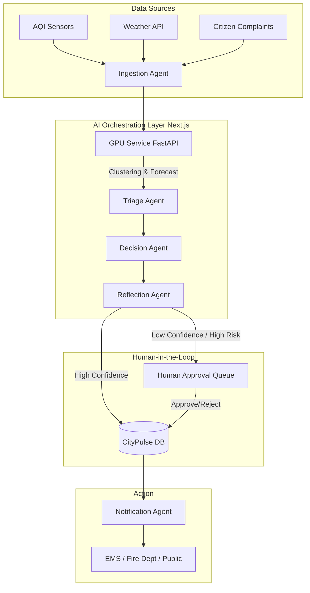

<div align="center">
  
  <h1>CityPulse AI</h1>
  <p><strong>Multi-Agent Decision Intelligence Platform for Urban Health Risk Management</strong></p>
  
  <p>
    
    
    
    
    
    
    
  </p>
</div>

---

## 🏆 Hackathon Submission

* **Hackathon:** [Google Gen AI Academy - APAC Edition (Cohort 2)](https://hack2skill.com/event/apac-genaiacademy)
* **Track:** Challenge Track 2: Autonomous Multi-Agent System (NVIDIA Sponsored)
* **Problem Statement:** Creating a resilient, multi-agent AI framework that ingests urban signals to intelligently forecast, triage, and resolve municipal health risks with human-in-the-loop oversight.

---

## 🧠 What is CityPulse AI?

CityPulse AI is a **live, multi-agent oversight platform** designed for municipal crisis management. It transforms raw, chaotic urban signals—such as live air quality fluctuations, weather changes, and localized citizen complaints—into prioritized, human-approved municipal actions.

Rather than just displaying numbers on a dashboard, CityPulse AI operates as a **society of cooperating AI agents**. These agents ingest data, run predictive GPU-accelerated simulations, triage incidents, debate mitigation strategies, and present a final, robust recommendation to human operators.

## ❓ Why This?

Modern cities generate massive amounts of data, but municipal decision-makers suffer from "alert fatigue." When an environmental crisis (like an industrial fire causing severe AQI spikes) occurs, operators don't need more data—they need **actionable intelligence**. 

CityPulse AI bridges the gap between raw data and municipal action by automating the heavy lifting of data correlation, forecasting, and policy checking, while keeping a **human firmly in the loop** for final approval.

## ⚙️ How it Works

The system operates via a continuous, stateful pipeline (powered by LangGraph principles):

1. **Ingestion:** Constantly monitors AQI, Weather, and citizen reports.
2. **GPU Forecasting & Triage:** Uses NVIDIA GPU-accelerated DBSCAN clustering and Linear Regression to predict hazard spread and identify hotspots.
3. **Decision & Reflection:** AI agents debate the best course of action based on historical precedents and municipal guidelines. If a decision is too risky, the Reflection Agent flags it.
4. **Human Oversight:** The proposed action is queued in the "Mission Control" dashboard. A human operator approves or rejects it (with feedback to train the AI).
5. **Notification:** Once approved, alerts are dispatched to relevant municipal departments or citizens.

---

## 🏗️ Architecture



---

## 💻 Tech Stack

| Component | Technology | Description |
| :--- | :--- | :--- |
| **Frontend** |  | React App Router, Tailwind CSS, Recharts |
| **Backend AI** |  | Python backend for heavy numerical compute |
| **GPU Compute**|  | cuDF, cuML for DBSCAN clustering & forecasting |
| **LLM Engine** |  | Agent reasoning, negotiation, and reflection |
| **Database** |  | Drizzle ORM (Development/Hackathon database) |
| **Deployment** |  | Single VM architecture for ultra-low latency |

---

## 🚀 Quick Setup (Local Dev)

```bash
# 1. Clone & Install
git clone https://github.com/Tetra4ge/CityPulse-AI.git
cd CityPulse-AI
npm install

# 2. Setup Environment
cp .env.example .env.local
# Add your Gemini/OpenRouter API Keys

# 3. Start Frontend
npm run dev

# 4. Start GPU Service (Separate Terminal)
cd gpu-service
pip install -r requirements.txt
uvicorn main:app --reload
```

---

<div align="center">
  <p>Built by <strong>Team TetraFourge</strong></p>
  <a href="https://github.com/Tetra4ge">
    
  </a>
</div>
